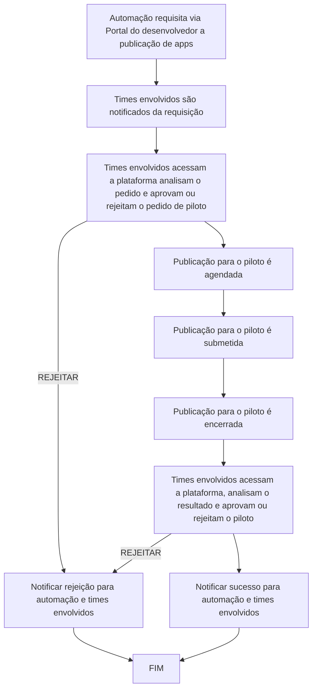

# Projeto M.A.L.A - MDM Abstraction Layer API

## Contexto
Atualmente, o processo de certificação de aplicativos em loja privada é realizado da seguinte forma:
1. A automação requisita via Portal do desenvolvedor a publicação de apps para um conjunto de dispositivos.
2. O pedido é tratado pelo time de interno e encaminhado para o time de gestão do MDM.
3. O time de gestão de MDM cruza as informações dos pedidos e, via interface do MDM, publica os dispositivos na campanha.

## Objetivo
Automatizar o processo de publicação de aplicativos de forma segura, com pontos de validação pelos times envolvidos.
Criar uma camada de abstração que faça interface com MDMs, permitindo que no futuro outros MDMs sejam anexados ou substituídos.

## Escopo de Atuação
- **Time interno**: Certificação, piloto e adição de dispositivos em uma campanha produtiva com limitação de volume de dispositivos.
- **Time MDM**: Realizar o rollout controlado da base restante.

## Meta do Projeto
Fornecer para as automações uma interface para solicitações de publicações de aplicativos em MDM (Mobile Device Management).

## Requisitos Funcionais do Sistema (Macro)

1. **Integração Modular com Múltiplos MDMs:**
   - **Descrição:** O sistema deve permitir a integração com diferentes MDMs de forma modular, facilitando a adição ou substituição de MDMs no futuro.
   - **Considerações:** 
     - Definir uma interface padrão para integração com MDMs.
     - Garantir que a adição de novos MDMs não afete os MDMs existentes.

2. **Segurança e Integridade dos Dados:**
   - **Descrição:** Garantir a segurança e integridade dos dados do pedido durante todo o processo de publicação.
   - **Considerações:**
     - Implementar autenticação e autorização robustas.
     - Utilizar criptografia para dados em trânsito e em repouso.
     - Manter logs de auditoria detalhados.

3. **Logs Detalhados e Relatórios de Auditoria:**
   - **Descrição:** Fornecer logs detalhados e relatórios de auditoria para todas as operações realizadas.
   - **Considerações:**
     - Definir quais eventos devem ser logados.
     - Garantir que os logs sejam imutáveis e armazenados de forma segura.

4. **Notificações e Alertas:**
   - **Descrição:** Implementar notificações e alertas para falhas ou eventos importantes no processo de publicação.
   - **Considerações:**
     - Definir os tipos de eventos que devem gerar notificações.
     - Integrar com sistemas de notificação existentes (e-mail, SMS, etc.).

5. **Escalabilidade:**
   - **Descrição:** Suportar a escalabilidade para lidar com um grande volume de dispositivos e aplicativos.
   - **Considerações:**
     - Utilizar arquitetura de microsserviços para facilitar a escalabilidade.
     - Implementar balanceamento de carga e autoescalonamento.

6. **Reversão de Publicações:**
   - **Descrição:** Permitir a reversão de publicações em caso de erros ou problemas detectados.
   - **Considerações:**
     - Definir um processo claro para reversão de publicações.
     - Garantir que a reversão seja segura e não cause inconsistências.

7. **Conformidade com Políticas de Segurança e Privacidade:**
   - **Descrição:** Assegurar conformidade com as políticas de segurança e privacidade da organização.
   - **Considerações:**
     - Realizar auditorias regulares de segurança.
     - Garantir que o sistema esteja em conformidade com regulamentações relevantes (LGPD, GDPR, etc.).

8. **APIs para Gerenciamento de Aplicativos e Publicações:**
   - **Descrição:** Fornecer diversas APIs para gerenciamento de aplicativos e publicações.
   - **Considerações:**
     - Definir endpoints claros e bem documentados.
     - Garantir que as APIs sejam seguras e performáticas.

## Lista de APIs

1. **API para Submeter Versões de Aplicativos Certificados:**
   - **Descrição:** Permitir a submissão de versões de aplicativos certificados, segmentados por modelo de dispositivo.

2. **API para Obter Identificador das Versões de um Aplicativo:**
   - **Descrição:** Obter o identificador das versões de um determinado aplicativo, assim como seus modelos suportados.

3. **API para Requisitar Processo de Publicação Controlado:**
   - **Descrição:** Requisitar o processo de publicação controlado tendo como entrada o aplicativo selecionado, identificador da versão e lista de dispositivos compatíveis.

4. **API para Aprovar Processo de Publicação Controlado:**
   - **Descrição:** Autorizar ou Rejeitar o processo de publicação.

5. **API para Aprovar Processo de Piloto:**
   - **Descrição:** Autorizar ou Rejeitar o piloto.

6. **API para Obter Status da Requisição de Publicação por Dispositivo:**
   - **Descrição:** Obter o status da requisição de publicação por dispositivo, incluindo detalhes sobre falhas específicas e tentativas de reprocessamento.

7. **API para Obter Status da Publicação dos Dispositivos para um Aplicativo:**
   - **Descrição:** Obter o status da publicação dos dispositivos para um determinado aplicativo.

8. **API para Obter Status da Publicação dos Aplicativos para um Dispositivo:**
   - **Descrição:** Obter o status da publicação dos aplicativos para um determinado dispositivo.

9. **API para Configurar Janelas de Publicação Global:**
   - **Descrição:** Configurar janelas de publicação global.

10. **API para Configurar Janelas de Publicação por Aplicativo e Modelo de Dispositivo:**
   - **Descrição:** Configurar janelas de publicação por aplicativo e modelo de dispositivo (sobrepõe publicação global).

11. **API para Configurar Janelas de Congelamento Global:**
    - **Descrição:** Configurar janelas de congelamento global (sobrepõe publicação por aplicativo e modelo de dispositivo).

12. **API para Configurar Janelas de Congelamento por Aplicativo e Dispositivo:**
    - **Descrição:** Configurar janelas de congelamento por aplicativo e dispositivo (sobrepõe congelamento global).

## Limitações e Exclusões do Sistema

### O que Não Está no Escopo

1. **Suporte a Dispositivos Não Certificados:**
   - **Descrição:** O sistema não fornecerá suporte para dispositivos que não estejam certificados ou homologados pela organização.

2. **Gerenciamento de Inventário de Dispositivos:**
   - **Descrição:** O sistema não incluirá funcionalidades para gerenciamento de inventário de dispositivos.

3. **Suporte Técnico aos Usuários Finais:**
   - **Descrição:** O sistema não oferecerá suporte técnico direto aos usuários finais dos dispositivos.

4. **Desenvolvimento de Aplicativos:**
   - **Desenvolvimento e Manutenção de Aplicativos:**
      - **Descrição:** O sistema não será responsável pelo desenvolvimento, manutenção ou atualização dos aplicativos a serem publicados.

5. **Monitoramento de Desempenho dos Aplicativos:**
   - **Descrição:** O sistema não incluirá funcionalidades para monitoramento de desempenho dos aplicativos após a publicação.

6. **Rollout de Versão de Aplicativos:**
   - **Descrição:** O sistema será limitado ao escopo de piloto controlado e à adição de novos dispositivos. A gestão dos dispositivos presentes na base ou após adição pela automação ficará sob domínio do time MDM.

## Passos sugeridos
   - **Priorizar Requisitos:** Identificar quais requisitos são críticos e devem ser implementados primeiro.
   - **Definir Métricas de Sucesso:** Estabelecer métricas para avaliar o sucesso do sistema, como tempo de resposta das APIs, número de dispositivos suportados, etc.
   - **Plano de Manutenção:** Incluir um plano de manutenção para garantir que o sistema continue funcionando corretamente após a implementação.
   - **Definir Métricas de Sucesso:** Estabelecer métricas para avaliar o sucesso do sistema, como tempo de resposta das APIs, número de dispositivos suportados, etc.
   - **Plano de Manutenção:** Incluir um plano de manutenção para garantir que o sistema continue funcionando corretamente após a implementação.

## Aplicativo certificado e submetido ao M.A.L.A

